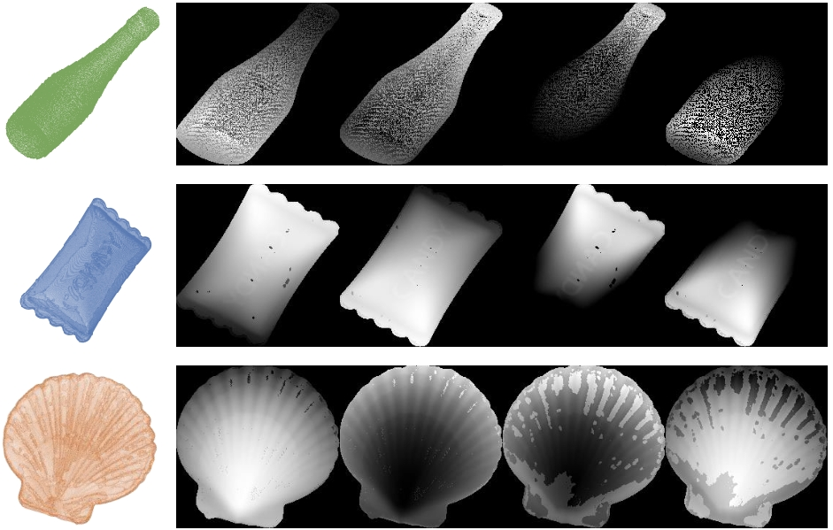

# Look Inside for More: Internal Spatial Modality Perception for 3D Anomaly Detection
Hanzhe Liang, Guoyang Xie, Chengbin Hou, Bingshu Wang, Can Gao†, Jinbao Wang†
(† Corresponding authors)

# Overview
This is the Reproducible Realisation of the AAAI25 paper ["Look Inside for More: Internal Spatial Modality Perception for 3D Anomaly Detection"](https://arxiv.org/abs/2412.13461). 

😭 Because of a server storage disaster, our initial version of the code was lost, however, thanks to the help of some researchers, we have reproduced an approximation of the code for this paper. If you have a better reproduction, please get in touch with us at 2023362051@email.szu.edu.cn.

code1 represents a fast version and code2 represents a more performant version. Note that the code2 implementation seems to perform better than our official implementation, but their implementation is not the same as the storage the authors remember, compliments of their coding abilities!

# ISMP


## Before that, a few caveats:

Our code implementation is based on the Nips23 paper "Real3D-AD: A Dataset of Point Cloud Anomaly Detection" and we thank them for their work!

Similar to their work, our code is also stochastic, and the results in the paper are obtained by means of the mean. If there are some discrepancies between your implementation and the values in the paper, it may be due to randomness and we are working on addressing it. To try to be as consistent as possible, you can use either the RTX3090 (24GB) mentioned in the paper or the RTX4090 (24GB) from when we published the code.

## Data and Checkpoints

Please download the [Real3D-AD dataset](https://github.com/M-3LAB/Real3D-AD?tab=readme-ov-file) and place it in the directory ```data/ ```.

Please download the [PointMAE checkpoints](https://github.com/Pang-Yatian/Point-MAE/releases/download/main/pretrain.pth) and place it in the directory ```checkpoints/```.

## Our Environment, Train, and Evaluation
We implement benchmark under CUDA 11.3 Our environment can be reproduced by the following command:
```bash
conda env create -f environment.yaml
pip install "git+git://github.com/erikwijmans/Pointnet2_PyTorch.git#egg=pointnet2_ops&subdirectory=pointnet2_ops_lib"
```
### how to train and evaluate code 1?

Run it:

```bash
python3 main.py --gpu 0 --seed 42 --memory_size 10000 --anomaly_scorer_num_nn 3 --faiss_on_gpu --faiss_num_workers 8 sampler -p 0.1 approx_greedy_corest #eval on Real3D-AD
```

### how to train and evaluate code 2?

First, you need to open the file:```root/miniconda3/lib/python3.8/site-packages/faiss/__init__.py```. Then, replace this file with the```__init__.py``` our provided.

Run it:

```bash
python3 main.py --gpu 0 --seed 42 --memory_size 10000 --anomaly_scorer_num_nn 3 --faiss_on_gpu --faiss_num_workers 8 sampler -p 0.1 approx_greedy_corest #eval on Real3D-AD
```

# Please Note
Our code, submitted by other researchers, is missing some of the implementation, but achieves some of the performance, and we welcome new submissions to exceed the level in the paper.
# Acknowledgments
This work was supported by the National Natural Science Foundation of China (Grant Nos. 62206122, 62476171, 82261138629, 62302309), the Guangdong Basic and Applied Basic Research Foundation (No. 2024A1515011367), the Guangdong Provincial Key Laboratory (Grant No. 2023B1212060076), Shenzhen Municipal Science and Technology Innovation Council (Grant No. JCYJ20220531101412030), Tencent ``Rhinoceros Birds” - Scientific Research Foundation for Young Teachers of Shenzhen University, and the Internal Fund of National Engineering Laboratory for Big Data System Computing Technology (Grant No. SZU-BDSC-IF2024-08).

# BibTex Citation
If you find this paper and repository useful, please cite our paper:
```bibtex
@misc{liang2025lookinsidemoreinternal,
      title={Look Inside for More: Internal Spatial Modality Perception for 3D Anomaly Detection}, 
      author={Hanzhe Liang and Guoyang Xie and Chengbin Hou and Bingshu Wang and Can Gao and Jinbao Wang},
      year={2025},
      eprint={2412.13461},
      archivePrefix={arXiv},
      primaryClass={cs.CV},
      url={https://arxiv.org/abs/2412.13461}, 
}
```
